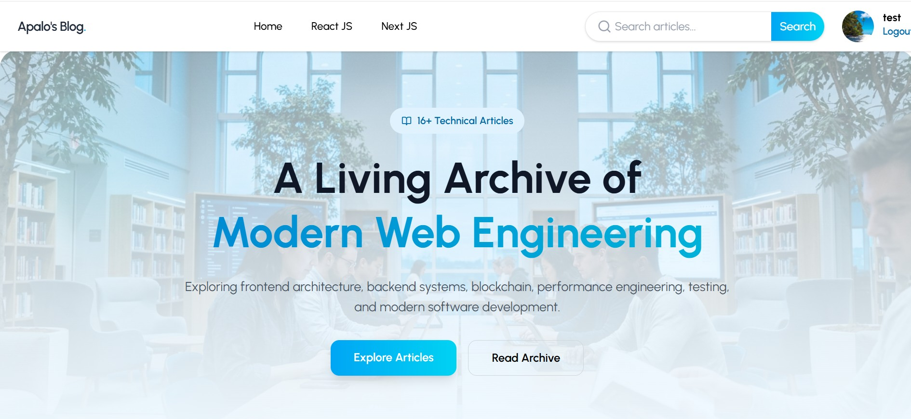
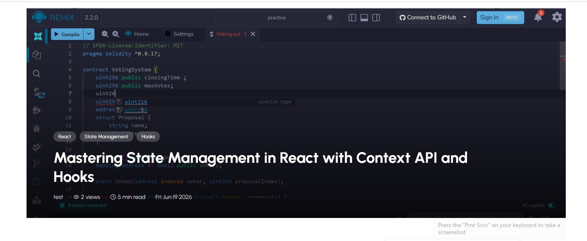
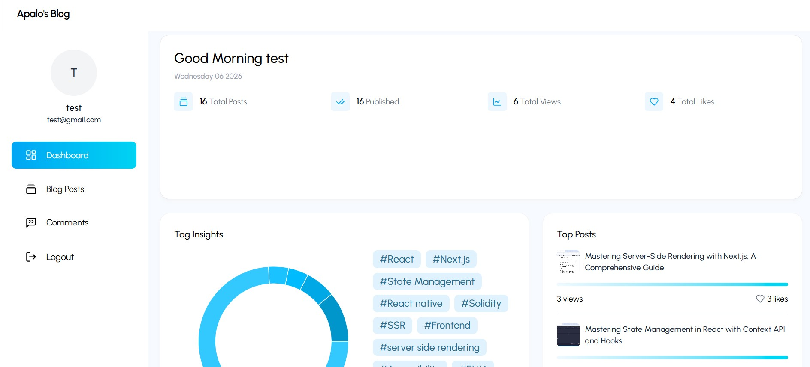
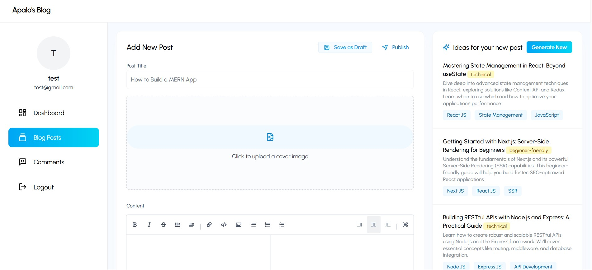
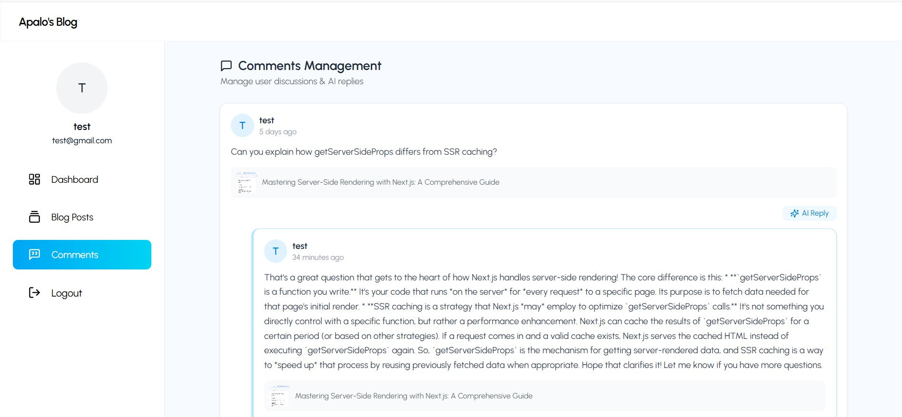
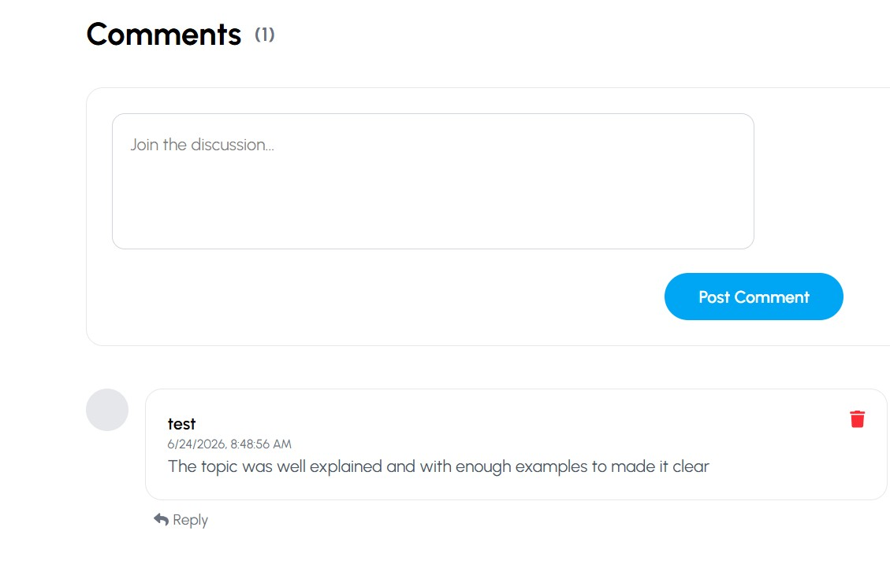

# AI Blog Platform

An intelligent full-stack blogging platform built with the MERN stack that enables users to explore articles, interact through comments and likes, and allows administrators to manage content efficiently with AI-powered features.

---

## 🚀 Features

### 🌐 Public Features

* Browse published blog posts
* Responsive modern blog UI
* View individual blog articles
* Search articles by title or content
* Filter posts by tags
* Trending posts section
* Popular tags section
* Pagination support
* View count tracking
* Like posts (authenticated users only)
* Comment system with nested replies
* Newsletter subscription UI

### 🔐 Authentication

* User Registration
* User Login
* JWT Authentication
* Protected Routes
* Role-based Authorization
* Admin-only dashboard access

### 🛠️ Admin Features

* Create blog posts
* Edit existing posts
* Delete posts
* Draft & Publish functionality
* Upload cover images
* Manage comments
* Delete any comment
* Dashboard analytics

### 🤖 AI Features

* AI-assisted blog content generation
* AI-generated comment replies
* AI integration using Gemini API

---

## 🏗️ Tech Stack

### Frontend

* React.js
* React Router DOM
* Tailwind CSS
* Axios
* React Icons
* React Hot Toast
* Moment.js

### Backend

* Node.js
* Express.js
* MongoDB
* Mongoose
* JWT Authentication
* Multer

### AI

* Google Gemini API

---

## 📂 Project Structure

```bash
blog-app/
│
├── frontend/
│   ├── src/
│   ├── components/
│   ├── pages/
│   └── utils/
│
├── backend/
│   ├── controllers/
│   ├── models/
│   ├── routes/
│   ├── middleware/
│   └── config/
│
└── README.md
```

---

## ⚙️ Environment Variables

Create a `.env` file inside the backend directory.

```env
PORT=8000

MONGO_URI=your_mongodb_connection_string

JWT_SECRET=your_jwt_secret

GEMINI_API_KEY=your_gemini_api_key

CLIENT_URL=http://localhost:5173
```

---

## 📦 Installation

### Clone the repository

```bash
git clone https://github.com/yourusername/ai-blog-platform.git
cd ai-blog-platform
```

---

### Backend Setup

```bash
cd backend

npm install

npm run dev
```

---

### Frontend Setup

```bash
cd frontend

npm install

npm run dev
```

---

## 📸 Screenshots

### Landing Page




---

### Blog Details



---

### Admin Dashboard



---

### Create Post



---

### Comments Management





---

## 🔮 Future Improvements

* Bookmark posts
* User profiles
* Social sharing
* Dark mode
* Email notifications
* Related posts recommendation
* Advanced analytics dashboard
* Rich text editor
* Reading history
* SEO optimization

---

## 🤝 Contributing

Contributions, issues, and feature requests are welcome.

Feel free to fork this repository and submit pull requests.

---

## 📄 License

This project is licensed under the MIT License.

---

## 👨‍💻 Author

**Ali Hassan**

If you found this project useful, consider giving it a ⭐ on GitHub.
